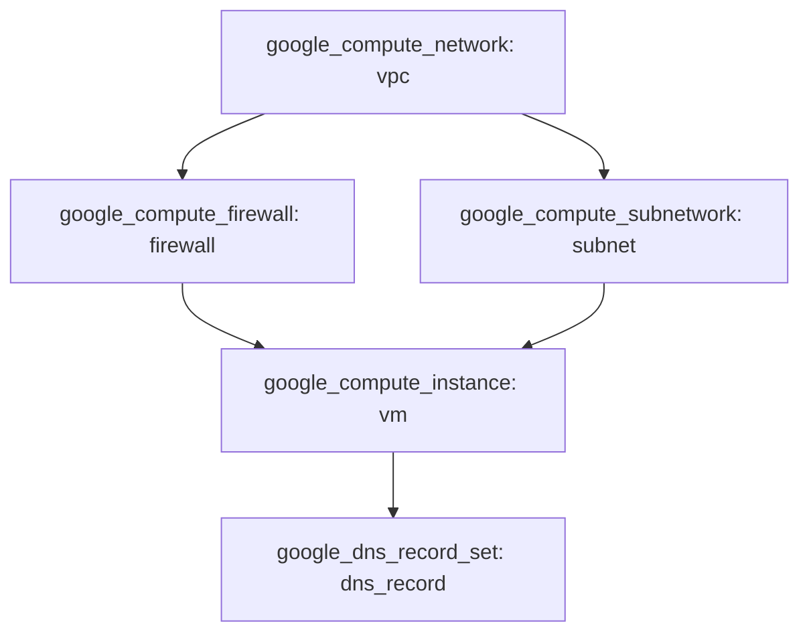

# Infrastructure Setup with Terraform
## 1. Diagram
The following diagram represents the infrastructure setup defined by the Terraform code:

## 2. Overview

This Terraform setup is designed to create a basic infrastructure on Google Cloud Platform, which includes a VPC network, a subnet, a VM instance, a firewall, and a DNS record. 

## 3. Workflow

- **Network Creation:** A VPC network and a subnet are created to facilitate the communication between the resources.
- **VM Instance:** A VM instance is deployed within the created subnet and is accessible via SSH.
- **Firewall Rules:** Firewall rules are defined to control the traffic to the VM instance, allowing specific ports (22 for SSH and 80 for HTTP).
- **DNS Record:** A DNS record is created to map a domain name to the VM instance's IP address.

  

