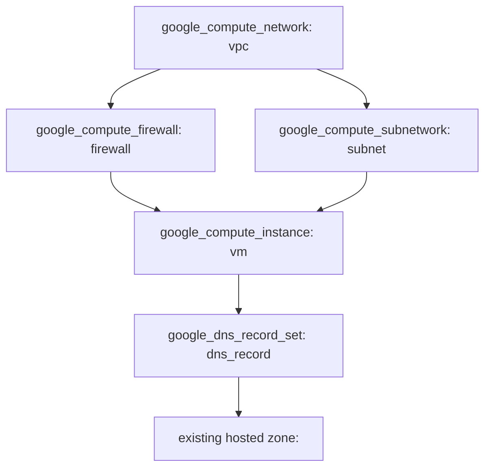

# Infrastructure Setup with Terraform
Before deploying this solution, ensure you have the following prerequisites:
## Prerequisites:
- **Project and related permission**: Ensure that a project was created in advance; Related API should be enabled; ServiceAccount with suitable permission should be created, and keys were downloaded to the terraform workstation in advance, which will be referenced in pervider.tf file.
- **Hosted Web Zone**: Ensure that a hosted web zone is created in Google Cloud DNS for your domain.
- **Domain Name**: Ensure that you have a registered domain name and it is configured to use the name servers provided by Google Cloud DNS.
- **GCP cloud CLI**: Ensure that GCP cloud cli was installed 
- **Basic knowledge**: Know basic knowledge of GCP and terraform

These prerequisites are crucial as the solution involves creating a DNS record that maps a domain name to the IP address of a VM instance, making the web page accessible via a friendly URL.

## 1. Usage
This solution can be utilized in various scenarios where a lightweight, single VM web hosting setup is desired. Here are a few usage scenarios:

- **Personal Blog or Portfolio**: Deploy a simple personal blog or portfolio website that doesn’t demand a complex infrastructure.
  
- **Development and Testing**: Create an isolated environment to test new features, designs, or content before pushing them to a production website.
  
- **Educational Purposes**: Use this setup as a learning tool to understand how to deploy and manage infrastructure on GCP using Terraform.

This solution provides a straightforward way to deploy a basic web hosting setup on GCP, which can be adapted and expanded upon based on specific use-cases and requirements.

## 2. Diagram
The following diagram represents the infrastructure setup defined by the Terraform code:

## 3. Solution Overview

This Terraform setup is designed to create a basic infrastructure on Google Cloud Platform, which includes a VPC network, a subnet, a VM instance, a firewall, and a DNS record. 

- **Network Creation:** A VPC network and a subnet are created to facilitate the communication between the resources.
- **VM Instance:** A VM instance is deployed within the created subnet and is accessible via SSH.
- **Firewall Rules:** Firewall rules are defined to control the traffic to the VM instance, allowing specific ports (22 for SSH and 80 for HTTP).
- **DNS Record:** A DNS record is created to map a domain name to the VM instance's IP address.

  

