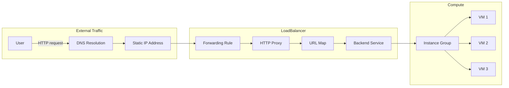
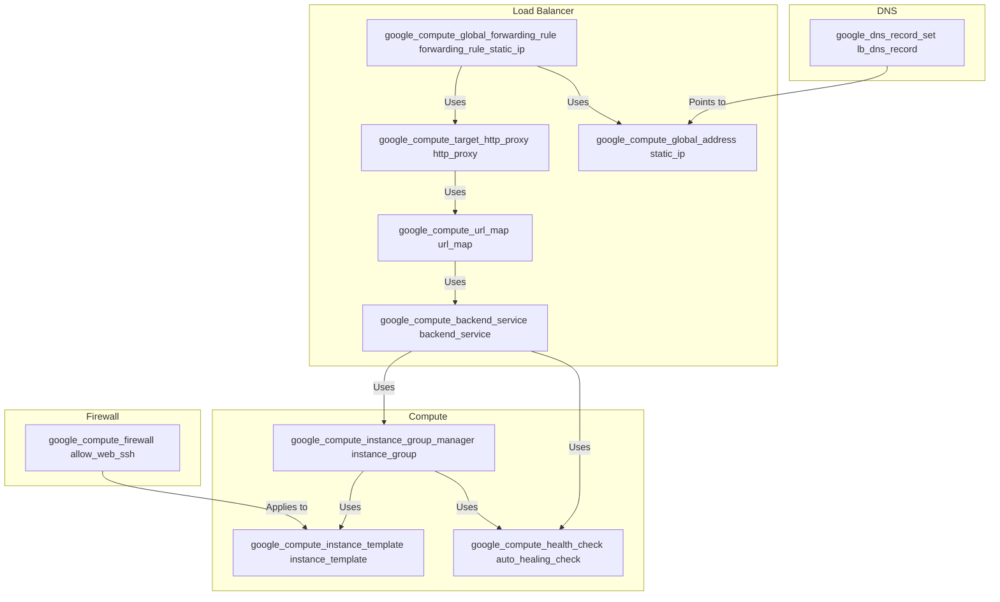

# Infrastructure Setup with Terraform on GCP

This Terraform solution is designed to deploy a scalable web hosting infrastructure on Google Cloud Platform (GCP). The setup includes a managed instance group, a load balancer, firewall rules, and DNS integration to ensure high availability and scalability for web applications.

## Prerequisites:

- **Project and related permission**: Ensure that a project was created in advance. Related APIs should be enabled. A ServiceAccount with suitable permissions should be created, and its keys should be downloaded to the terraform workstation in advance. These keys will be referenced in the `provider.tf` file.
  
- **VPC and subnet**: The default VPC and subnet is in place.
- **Hosted Web Zone**: Ensure that a hosted web zone is created in Google Cloud DNS for your domain.
  
- **Domain Name**: Ensure that you have a registered domain name and it is configured to use the name servers provided by Google Cloud DNS.
  
- **Basic knowledge**: Have a basic understanding of GCP and Terraform.

## 1. Usage:

This solution is ideal for scenarios that require scalable and high-availability web hosting on GCP. Here are some potential use cases:

- **Scalable Web Applications**: Deploy web applications that can handle varying amounts of traffic and can scale out or in based on demand.
  
- **E-commerce Websites**: Host e-commerce platforms that experience traffic spikes during sales or promotional events.
  
- **Content Management Systems**: Deploy CMS platforms that serve a large number of users and require high availability.
  
- **API Endpoints**: Host scalable API endpoints that can serve a large number of requests.

## 2. Diagram:
### Traffic routing

### Terraform modules relationship

## 3. Solution Overview:

- **Network and Subnet**: The solution utilizes an existing VPC network (`google_compute_network`) and subnet (`google_compute_subnetwork`) for resource communication.
  
- **Instance Template**: A VM instance template (`google_compute_instance_template`) is defined, which includes the specifications for the VM, such as machine type, disk configuration, and startup scripts. This template is used to create instances in the managed instance group.
  
- **Managed Instance Group**: A managed instance group (`google_compute_instance_group_manager`) is created using the instance template. This ensures that a specified number of instances are always running, providing high availability and scalability.
  
- **Load Balancer**: The solution sets up a load balancer comprising a backend service (`google_compute_backend_service`), URL map (`google_compute_url_map`), and an HTTP proxy (`google_compute_target_http_proxy`). This distributes incoming traffic across the VM instances in the managed instance group.
  
- **Firewall Rules**: Firewall rules (`google_compute_firewall`) are defined to control the traffic to the VM instances, allowing specific ports (22 for SSH and 80 for HTTP).
  
- **DNS Record**: A DNS record (`google_dns_record_set`) is created to map a domain name to the IP address of the load balancer. This ensures that the web application is accessible via a friendly URL.
